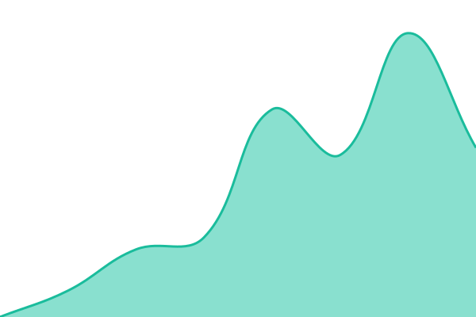
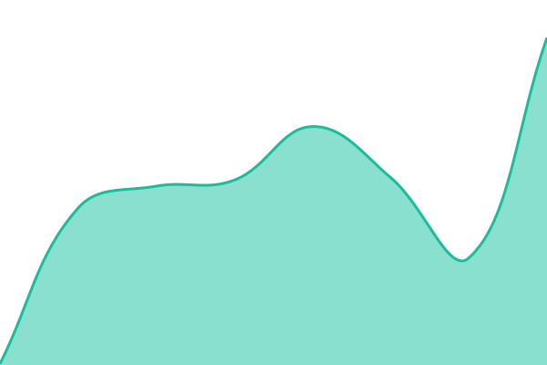

# [📈 Live Status](https://internetofwater.github.io/uptime.geoconnex.us): <!--live status--> **🟩 All systems operational**

This repository contains the open-source uptime monitor and status page for [Internet of Water](internetofwater.org), powered by [Upptime](https://github.com/upptime/upptime).

With [Upptime](https://upptime.js.org), you can get your own unlimited and free uptime monitor and status page, powered entirely by a GitHub repository. We use [Issues](https://github.com/internetofwater/uptime.geoconnex.us/issues) as incident reports, [Actions](https://github.com/internetofwater/uptime.geoconnex.us/actions) as uptime monitors, and [Pages](https://internetofwater.github.io/uptime.geoconnex.us) for the status page.

<!--start: status pages-->
<!-- This summary is generated by Upptime (https://github.com/upptime/upptime) -->
<!-- Do not edit this manually, your changes will be overwritten -->
<!-- prettier-ignore -->
| URL | Status | History | Response Time | Uptime |
| --- | ------ | ------- | ------------- | ------ |
|  [Geoconnex Persistent Identifier Service](https://pids.geoconnex.us) | 🟩 Up | [pid-service.yml](https://github.com/internetofwater/uptime.geoconnex.us/commits/HEAD/history/pid-service.yml) | 

 2244ms
     
 | 

<a href="https://uptime.geoconnex.us/history/pid-service">99.45%</a>
    

|  [Geoconnex Reference Feature Service](https://reference.geoconnex.us/collections) | 🟩 Up | [feature-service.yml](https://github.com/internetofwater/uptime.geoconnex.us/commits/HEAD/history/feature-service.yml) | 

 267ms
     
 | 

<a href="https://uptime.geoconnex.us/history/feature-service">100.00%</a>
    

|  [Geoconnex Knowledge Graph](https://graph.geoconnex.us) | 🟩 Up | [knowledge graph.yml](https://github.com/internetofwater/uptime.geoconnex.us/commits/HEAD/history/knowledge graph.yml) | 

 143ms
     
 | 

<a href="https://uptime.geoconnex.us/history/knowledge graph">100.00%</a>
    

<!--end: status pages-->

[**Visit our status website →**](https://internetofwater.github.io/uptime.geoconnex.us)

## 📄 License

- Powered by: [Upptime](https://github.com/upptime/upptime)
- Code: [MIT](./LICENSE) © [Anand Chowdhary](https://anandchowdhary.com)
- Data in the `./history` directory: [Open Database License](https://opendatacommons.org/licenses/odbl/1-0/)
